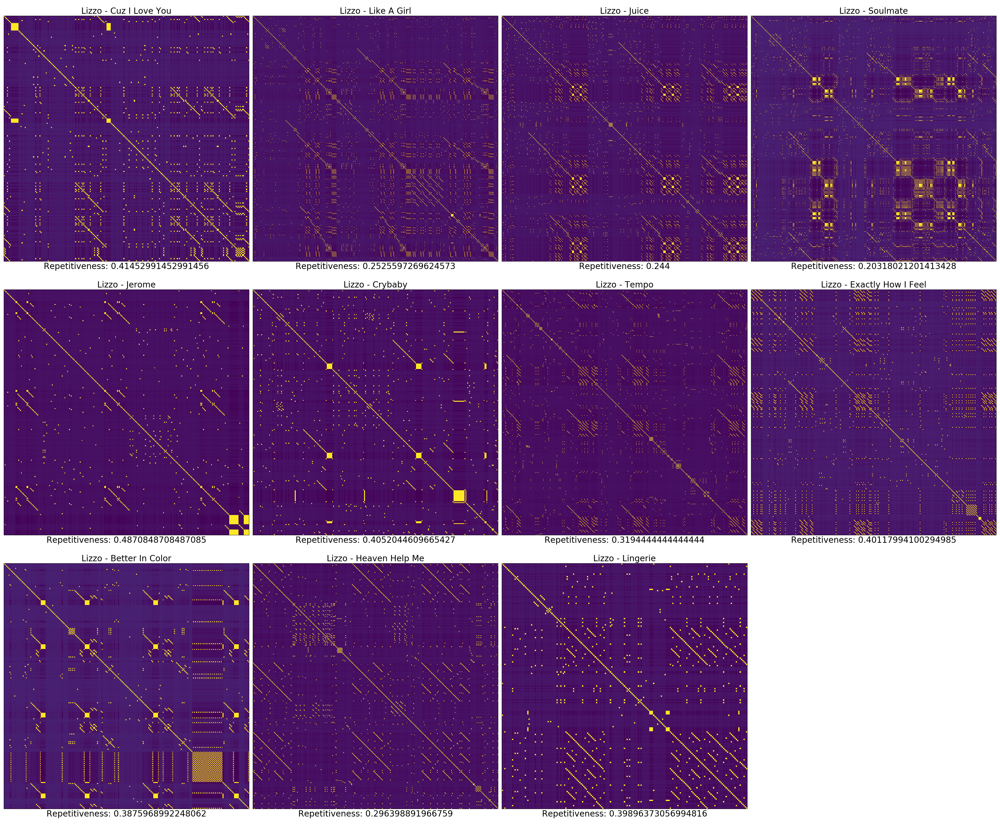
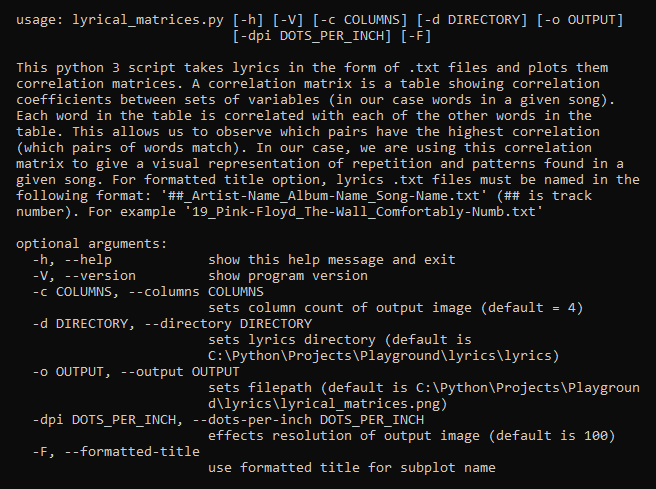
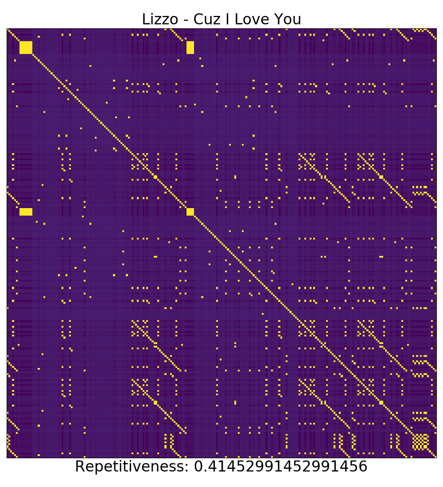
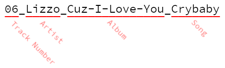

# Lyrical Matrices v0.1 #

### Output Example ###

### How to Use ###
The lyrical_matrices.py script will expect to see a directory named "lyrics" in the same directory as lyrical_matrices.py by default. The script will look in this directory for .txt files of lyrics. The directory that the script looks in for lyrics can be set with the -d option followed by the desired path. The script will process single or multiple lyrics .txt files and will scale the output image to display all the matrices. By default the images will be arrayed with a column width of 4; this can be optionally set with the -c, --columns argument. Additional options can be found with the -h, --help argument.

### Help Output ###

### The Basics ###
This is an example of a correlation matrix using the string of text "row row row your boat".

|      | row  | row  | row  | your | boat |
| ---: | :--: | :--: | :--: | :--: | :--: |
| row  |  1   |  1   |  1   |  0   |  0   |
| row  |  1   |  1   |  1   |  0   |  0   |
| row  |  1   |  1   |  1   |  0   |  0   |
| your |  0   |  0   |  0   |  1   |  0   |
| boat |  0   |  0   |  0   |  0   |  1   |

The script takes the words of the string across the x-axis and checks it against itself on the y-axis. The matrix is filled in by checking whether or not the x value is equal to the y value. Where the x value equals the y value, a 1 is logged. Where the x value does not match the y value, a 0 is logged.  

This script utilizes this concept at a much larger scale. When both the x and y axes are populated with a string of lyrics from a given song (or poem). When you run a correlation matrix with lyrics as an input, you get an output that looks like this:  Note: Repetitiveness is calculated by dividing the unique words in lyrics by the total word count in lyrics.

### Formatted Title Option ###
The -F, --formatted-title option can be used to parse subplot title information and subplot order. This is useful for analyzing full albums. In order to use this function, the input lyric .txt files must be named in a particular configuration.  
  

**Without -F, --formatted-title Option:**  
  
**With -F, --formatted-title Option:**  
  

### Inspiration ###
This project was inspired by Colin Moris' TEDxPenn talk on "Pop Music is Stuck on Repeat" which can be found [here](https://www.youtube.com/watch?v=_tjFwcmHy5M).

### Change Log ###
2019-09-13 - v0.1:
- First release of the Lyrical Matrices script
- Added pipenv support
- Created README.md
